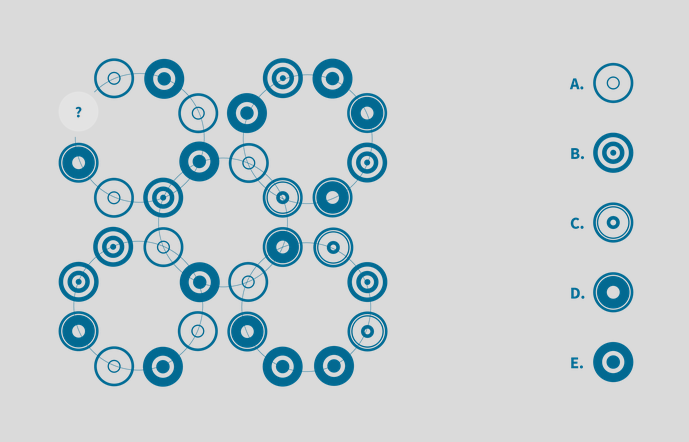

**AgnosticBayesEnsemble**  


​           __Auticon Analytics__




**_Overview_**

I have to thank my employer Auticon Berlin for letting me develop this package in my working time. Agnostic Bayes Ensemble is thought to be basis technology, that will be refined over time, furthermore it forms one pillar of a upcoming machine learning framework, which is supposed to consist of three broad branches: 

- cleaning and transformation of datasets.

- ensemble algorithms.

- general applicable meta parameter learning.

    

There are minimal requirements regarding the installation and usage of this package. Right now, the only prerequisite is running on a machine with Julia 1.X installed. However in the upcoming releases GPU support in form of CUDA will be integrated, from there on out, CUDA-DEV-Kit will become a prerequisite.  

This package has been developed to facilitate increased predictive performance, by combining raw base models in an agnostic fashion, i.e. the methods don’t use any assumption regarding the used raw models. Furthermore, we specifically implemented ensemble algorithms that can deal with arbitrary loss function and with regression and classification problems, this holds true for all, except for the dirichletPosterior estimation algorithm, which is limited to classification problems.

The algorithms bootstrapPosteriorEstimation, bootstrapPosteriorCorEstimation, dirichletPosteriorEstimation, TDistPosteriorEstimation infer an actual posterior distribution.

The algorithms  δOptimizationMSE ,   δOptimizationHinge ,  δOptimizationHingeRegularized,  δOptimizationMSERegularized do not, these algorithms are inferring mixing coefficients not required to be true probability distributuions . 

 **Hint**: In most cases it is advisable to _deactivate_ Hyperthreading for best performance.
However, in some rare cases – depending on the (hardware) platform the package runs on- you
will get the best performance with Hyperthreading enabled, to be sure, it is best practice to
measure the performance with and without Hyperthreading.


**_low level Interface_**


The Interface was designed to be easy to use, therefore all parameters needed by the algorithms in the package are either y_1, y_2, y_3, …, y_k the predictions per raw model along with the label vector T,
Or alternatively e_1, e_2, e_3, …, e_k the error between predicted and real labels and ground truth T.
Some of the methods need additional (prior-) parameters, however this simple basic structure is consistent along all implemented ensemble methods in this package.

___

**_Examples_**


"""
Basic usage Examples.

# Examples
```jldoctest

using AgnosticBayesEnsemble
using DataFrames
using Random
using Statistics
using StaticArrays
using Optim
using MultivariateStats


#== create artificial predictions and ground truth ==#
function distortBinaryPrediction( y::BitArray{1}, distortionFactor::Float64 )
​    res          = deepcopy( y );  
​    indices      = rand( 1:1:size( y, 1 ), round( Int64, distortionFactor * size( y, 1 ) ) );
​    res[indices] = .!y[indices];
​    return res;
end  

n    = 100000;
y    = Bool.( rand( 0:1,n ) );
yH1  = distortBinaryPrediction( y, 0.20 );
yH2  = distortBinaryPrediction( y, 0.21 );
yH3  = distortBinaryPrediction( y, 0.22 );
yH4  = distortBinaryPrediction( y, 0.23 );
yH5  = distortBinaryPrediction( y, 0.24 );
yH6  = distortBinaryPrediction( y, 0.24 );
yH7  = distortBinaryPrediction( y, 0.26 );
yH8  = distortBinaryPrediction( y, 0.27 );
yH9  = distortBinaryPrediction( y, 0.28 );
yH10 = distortBinaryPrediction( y, 0.29 );
yH11 = distortBinaryPrediction( y, 0.30 );
yH12 = distortBinaryPrediction( y, 0.33 );
yH13 = distortBinaryPrediction( y, 0.34 );
yH14 = distortBinaryPrediction( y, 0.35 );
yH15 = distortBinaryPrediction( y, 0.36 );
yH16 = distortBinaryPrediction( y, 0.37 );

#== split generated prediction set into disjoint sets eval and train==#
limit           = round( Int64, 0.7 * size( y, 1 ) );
predictions     = DataFrame( h1=yH1, h2=yH2, h3=yH3, h4=yH4, h5=yH5, h6=yH6, h7=yH7, h8=yH8, h9=yH9, h10=yH10, h11=yH11, h12=yH12, h13=yH13, h14=yH14, h15=yH15, h16=yH16 );
predTraining    = predictions[1:limit,:];
predEval        = predictions[limit+1:end,:];
predMatTraining = convert( Matrix{Float64}, predTraining );
predMatEval     = convert( Matrix{Float64}, predEval );
errMatTraining  = ( repeat( Float64.( y[1:limit] ),outer = [1,size(predictions,2)] ) .- predMatTraining ).^2;
errMatTraining  = convert( Matrix{Float64}, errMatTraining );
sampleSize      = 32
nrRuns          = 100000
α_              = 1.0

#== use bootstrap correlation algorithm to estimate the model posterior  distribution ==#
P = bootstrapPosteriorCorEstimation( predictions, y, sampleSize, nrRuns );

#== use bootstrap algorithm to estimate the model posterior distribution ==#
p = bootstrapPosteriorEstimation( Matrix( errMatTraining ), sampleSize, nrRuns ); 

#== use Dirichletian algorithm to estimate the model posterior distribution ==#
P = dirichletPosteriorEstimation( errMatTraining, nrRuns, α_ );

#== use T-Distribution algorithm to estimate the model posterior distribution ==#
P = TDistPosteriorEstimation( errMatTraining, nrRuns );


#== make ensemble prediction ==#
prediction = predictEnsemble( predictionsEval, p );
```
"""


**supported problems per algorithm**


|   algorithm    | univariate Classification | multivariate Classification | univariate Regression | multivariate Classification |
|:--------------:|:-------------------------:|:---------------------------:|:---------------------:|:---------------------------:|
| bootstrap      |            yes            |            yes              |         yes           |            yes              |
| bootstrap cor. |            yes            |            no               |         yes           |            no               |
| dirichletian   |    yes, only {0,1}-loss   |     yes, only {0,1}-loss    |         no            |            no               |
| t-distribution |            yes            |            yes              |         yes           |            yes              |

___


_**supported problems per fine tuning algorithms**_


|           algorithm           | univariate Classification | multivariate Classification | univariate Regression | multivariate Classification |
|:-----------------------------:|:-------------------------:|:---------------------------:|:---------------------:|:---------------------------:|
| δOptimizationMSE              |            yes            |             no              |           yes         |             no              |
| δOptimizationHinge            |            yes            |             no              |           no          |             no              |
| δOptimizationHingeRegularized |            yes            |             no              |           no          |             no              |
| δOptimizationMSERegularized   |            yes            |             no              |           yes         |             no              |